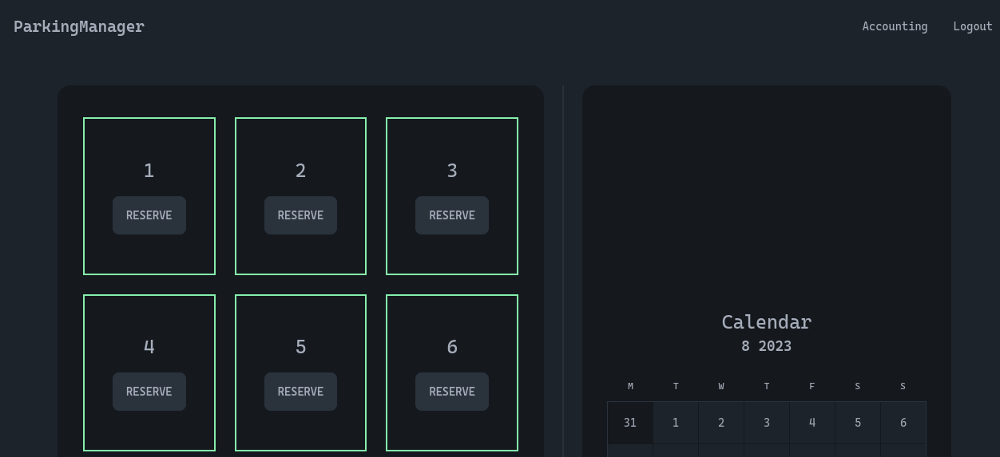

# IFA VICC - Parking App

Flask Application for module XXXX

 <!-- If applicable -->

## Table of Contents

- [About the Project](#about-the-project)
  - [Features](#features)
- [Getting Started](#getting-started)
  - [Prerequisites](#prerequisites)
  - [Installation](#installation)
- [Testing](#testing)

## About the Project

Application implementing basic flask features. These are given by the module requirements. A list of implemented features can be found below

### Features

- Flask App
- Database Setup (Sqlite and Postgres with SqlAlchemy)
- Datebase Migratons
- User Login / Registration
- Parking Spot Reservation in the current Month
- Unit and Integration Testing (local and via Github actions)
- Docker setup and deployement to XXXXX

## Getting Started

### Prerequisites

You should have python installed and a running docker setup to work with postgres

### Installation

Follow these steps to set up and run the Flask application in a virtual environment:

1. **Clone the Repository:**

   ```bash
   git clone git@github.com:thywidi/ifa-vicc.git
   ```

2. **Navigate to the Project Directory:**

   ```bash
   cd ifa-vicc
   ```

3. **Create and Activate a Virtual Environment:**

   On macOS and Linux:

   ```bash
   python3 -m venv .venv
   source .venv/bin/activate
   ```

   On winows, use WSL

4. **Install Dependencies:**

   ```bash
   pip install -r requirements.txt
   ```

5. **Setup env files:**

   ```bash
   cp .flaskenv.dist .flaskenv
   cp .env.dist .env
   ```

6. **Start docker containers(database):**

   ```bash
   docker-compose up -d
   ```

   This will start the whole docker setup. For dev we need only the database, but you can use the setup to test the final deployement

7. **Start dev server:**

   ```bash
   flask run
   ```

   To develop we use the dev server with flask

8. **Deactivate the Virtual Environment:**

   When you're done using the app, you can deactivate the virtual environment:

   ```bash
   deactivate
   ```

   This will return you to your system's global Python environment.

## Testing

Tests can be run locally with pytest

```bash
pytest # pyproject.toml specifies tests to be located in /tests
```

In addition tests are also run via github actions on push to main
